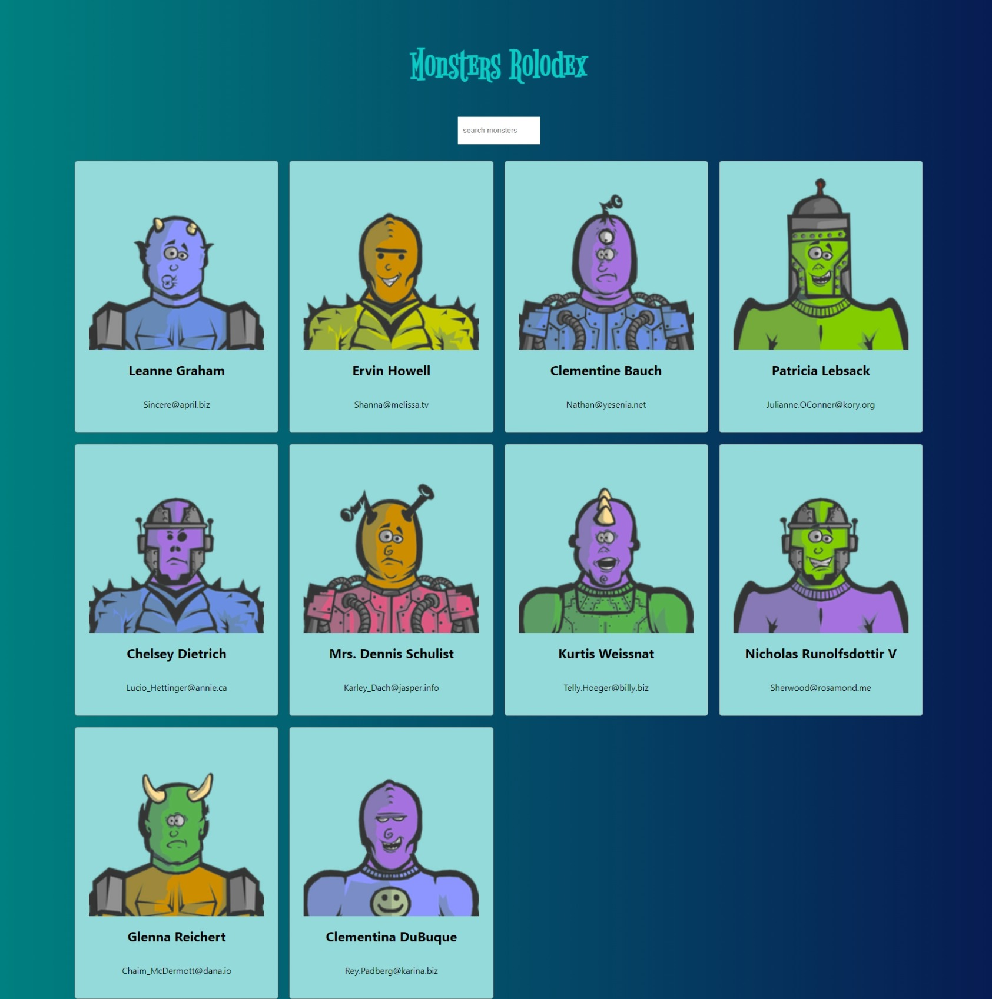

# Monsters Rolodex
This is a simple React app that allows you to search for monsters by name. It uses the [Robohash API](https://robohash.org/) to generate monster images and the [JSONPlaceholder API](https://jsonplaceholder.typicode.com/) to generate fake user data.

## Features
- Search for monsters by name
- Generate random monster images
- Generate fake user data

## How to run the app
Clone this repo
```
git clone
```
Run npm install
```
npm install
```
Run npm start
```
npm start
```

## Screenshot
Here we have project screenshot :



## License
This repo is published under the MIT license. For more information, please see the [LICENSE](https://github.com/efxlve/monsters-rolodex/blob/main/LICENSE) file.
